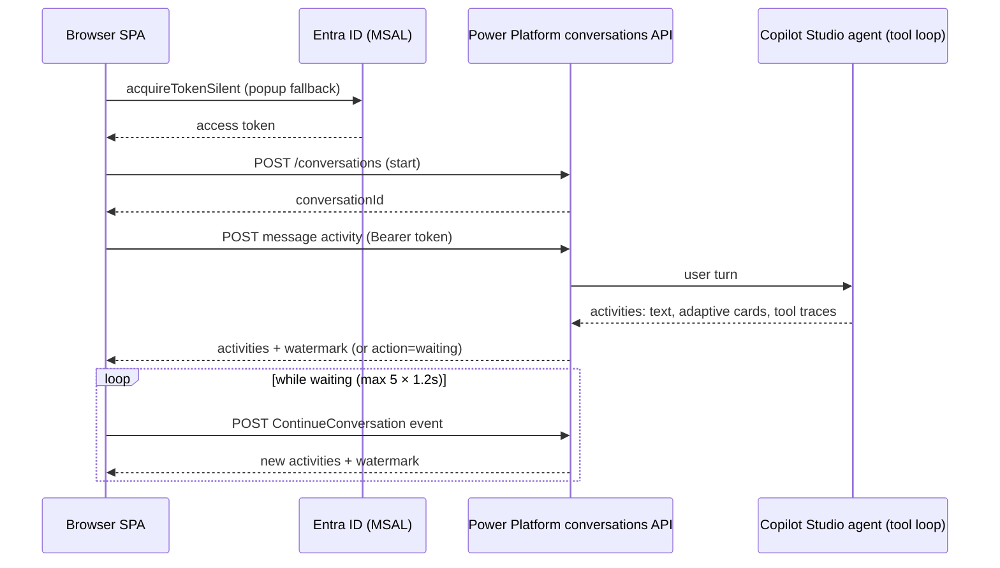

# Sales Intelligence Agent — Web Client

A single-page React client for a sales-intelligence conversational agent hosted on Microsoft Copilot Studio, built for an enterprise services client and presented here with generic naming. Users sign in with Microsoft Entra ID, chat with the hosted agent over the Power Platform conversations REST API, see the agent's tool invocations in a live trace panel, act on Adaptive Card consent prompts inline, and export the conversation to PDF.

## Architecture at a glance

- **Orchestration pattern:** single-agent tool loop, hosted server-side. The browser app is a thin protocol client: it POSTs the user's message to one Copilot Studio agent and renders whatever that agent's internal tool loop produces (text, Adaptive Cards, tool-call traces). Client-side, each turn is strictly sequential — send activity, then a bounded short-poll (`ContinueConversation` events, up to 5 attempts at 1.2 s) while the service reports `action: "waiting"`.
- **Model/framework:** no model runs in this repo. The agent (and whatever model backs it) lives in Copilot Studio behind an authenticated `…/copilotstudio/dataverse-backed/authenticated/bots/<bot>/conversations` endpoint. The client is React 19 + TypeScript + Vite, Tailwind CSS, MSAL (`@azure/msal-browser` / `@azure/msal-react`).
- **Memory / session state:** conversation identity is a `conversationId` plus incremental `watermark`, both held in React state for the life of the page; conversational memory itself is server-side. MSAL caches tokens in `sessionStorage`; the theme choice persists in `localStorage`. A page refresh starts a new conversation.
- **Retrieval:** none in this repo. Any retrieval/grounding happens inside the hosted agent.



## Quickstart

```bash
git clone https://github.com/git-bonda108/copilot-studio-agent-client.git
cd copilot-studio-agent-client
npm install
cp .env.example .env   # fill in values — see the table below
npm run dev
```

Expected output from `npm run dev`:

```
  VITE ready in ~400 ms
  ➜  Local:   http://localhost:5173/
```

Open the local URL, press **Sign in**, complete the Entra ID popup, and send a message. Without a `VITE_AZURE_CLIENT_ID` the app still renders but shows a banner and keeps the Sign in button disabled.

Production build:

```bash
npm run build    # runs tsc -b, then vite build
npm run preview
```

Expected: type-check passes and Vite emits `dist/` (the main JS chunk is currently ~990 kB minified / ~300 kB gzip, and Vite prints a chunk-size warning — see docs/ARCHITECTURE.md, "Extending this system").

Lint: `npm run lint` (ESLint 9 flat config with react-hooks and react-refresh rules).

## Configuration

All configuration is build-time via Vite `VITE_*` variables (see `.env.example`, typed in `src/env.d.ts`, consumed in `src/config.ts`).

| Variable | What it is | Where to get it |
|---|---|---|
| `VITE_AZURE_CLIENT_ID` | Entra ID application (client) ID of the SPA app registration. Required for real sign-in. | Azure portal → Entra ID → App registrations → your SPA app → Overview |
| `VITE_AZURE_AUTHORITY` | Token authority. Defaults to `https://login.microsoftonline.com/common` (multi-tenant). | Use `https://login.microsoftonline.com/<tenant-id>` to pin a tenant |
| `VITE_AZURE_SCOPES` | Comma-separated token scopes. Defaults to `https://api.powerplatform.com/.default`. | Determined by the API your agent endpoint requires |
| `VITE_REDIRECT_URI` | OAuth redirect URI. Defaults to `http://localhost:5173`. | Must match a SPA redirect URI on the app registration |
| `VITE_AGENT_ENDPOINT` | Authenticated Copilot Studio conversations endpoint: `https://<environment-id>.environment.api.powerplatform.com/copilotstudio/dataverse-backed/authenticated/bots/<bot-schema-name>/conversations?api-version=2022-03-01-preview` | Copilot Studio → your agent → channel/endpoint settings |

Note: `src/config.ts` carries a hardcoded default endpoint for one specific environment; setting `VITE_AGENT_ENDPOINT` overrides it. Prefer the environment variable.

## Deployment

`.github/workflows/deploy-pages.yml` builds with `--base=/copilot-studio-agent-client/` and deploys `dist/` to GitHub Pages on every push to `main`, reading the `VITE_*` values from repository **variables** (they are public build-time values, not secrets). The Pages site must be enabled in the repository settings for the deploy job to publish. The README section on Azure Static Web Apps–style hosting applies equally: build the Vite app and serve `dist/` statically with the same variables set at build time.

## Deeper documentation

- [docs/ARCHITECTURE.md](docs/ARCHITECTURE.md) — component map, protocol data flow, state and context handling, design trade-offs, and next steps.
- [docs/EVALUATION.md](docs/EVALUATION.md) — what is (and is not) tested today, edge cases the code handles, and a proposed evaluation harness.
- [docs/HARDENING.md](docs/HARDENING.md) — current security posture and a staged path to production.
